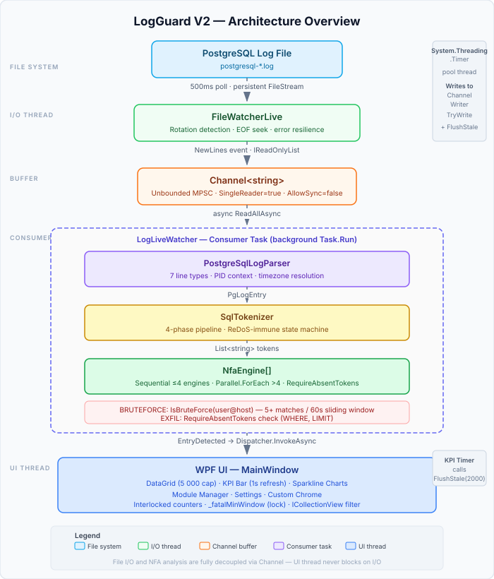
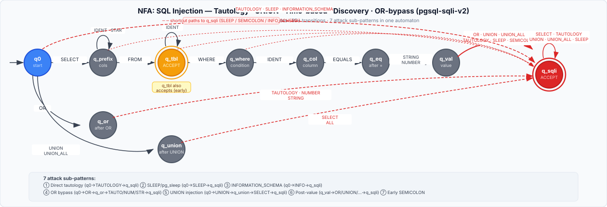
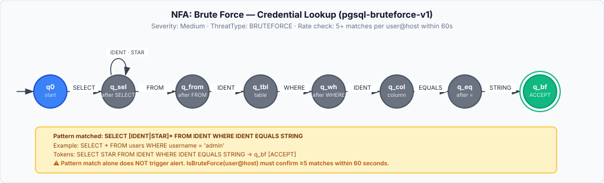
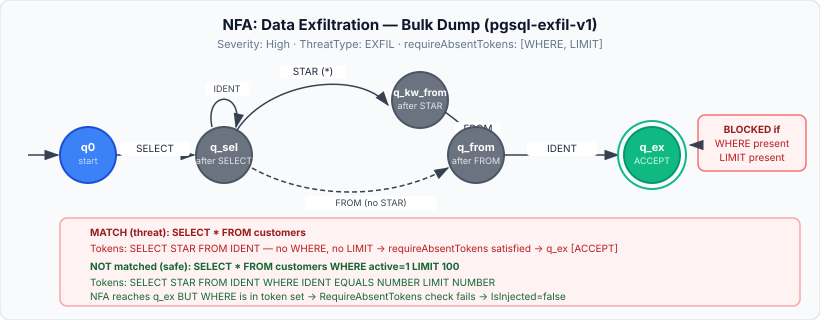
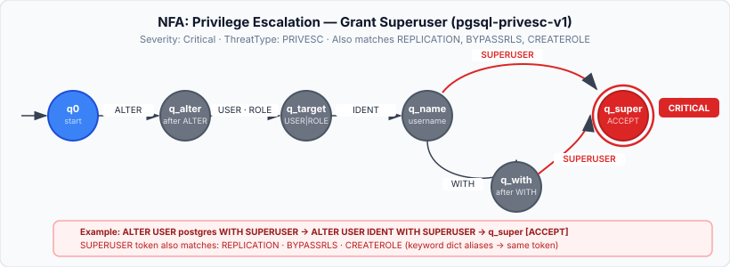
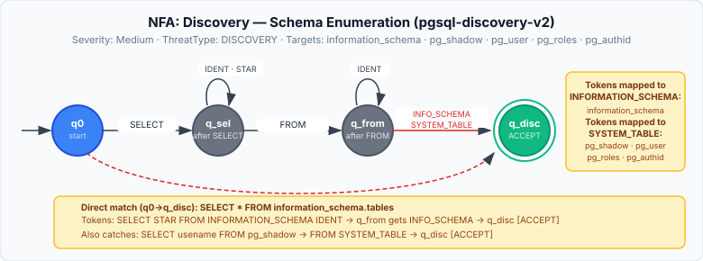
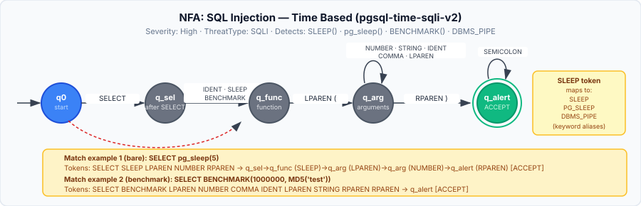
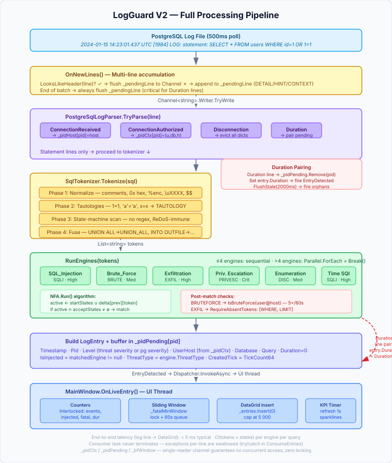
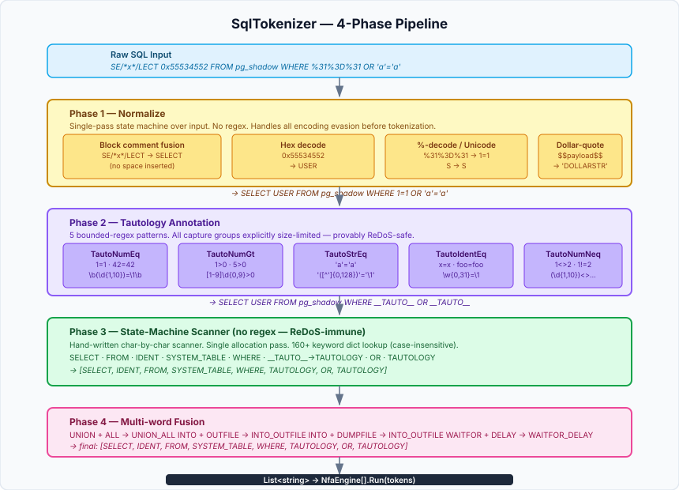

# LogGuard V2

> **Detección de amenazas en PostgreSQL en tiempo real mediante análisis de logs basado en NFA**

LogGuard V2 es una aplicación de escritorio WPF para Windows que monitorea logs de bases de datos PostgreSQL en tiempo real, tokeniza consultas SQL y las ejecuta a través de Autómatas Finitos No-deterministas (NFA) configurables para detectar inyecciones SQL, ataques de fuerza bruta, escalada de privilegios, exfiltración de datos y enumeración de esquemas — con latencia de coincidencia de patrones inferior a un milisegundo.

---

## Tabla de Contenidos

- [Vista General de la Arquitectura](#vista-general-de-la-arquitectura)
- [Estructura de Carpetas](#estructura-de-carpetas)
- [Componentes Principales](#componentes-principales)
  - [FileWatcherLive](#filewatcherlive)
  - [LogLiveWatcher](#loglive-watcher)
  - [PostgreSqlLogParser](#postgresqllogparser)
  - [SqlTokenizer](#sqltokenizer)
  - [NfaEngine](#nfaengine)
  - [NfaLoader](#nfaloader)
- [Modelos de Datos](#modelos-de-datos)
  - [LogEntry](#logentry)
  - [NFAModule](#nfamodule)
  - [AppSettings](#appsettings)
- [Sistema de Autómatas NFA](#sistema-de-autómatas-nfa)
  - [Referencia del Esquema JSON](#referencia-del-esquema-json)
  - [Estructura de Estados y Transiciones](#estructura-de-estados-y-transiciones)
  - [Cómo el Engine Carga y Ejecuta Autómatas](#cómo-el-engine-carga-y-ejecuta-autómatas)
  - [Perfiles de Amenaza Integrados](#perfiles-de-amenaza-integrados)
- [Pipeline de Procesamiento](#pipeline-de-procesamiento)
  - [Diagrama Completo del Pipeline](#diagrama-completo-del-pipeline)
  - [Acumulación de Entradas Multi-línea](#acumulación-de-entradas-multi-línea)
  - [Correlación de Contexto por PID](#correlación-de-contexto-por-pid)
  - [Emparejamiento de Duration](#emparejamiento-de-duration)
  - [Ventana Deslizante de Fuerza Bruta](#ventana-deslizante-de-fuerza-bruta)
- [Análisis Profundo del Tokenizador SQL](#análisis-profundo-del-tokenizador-sql)
  - [Fase 1 — Normalización](#fase-1--normalización)
  - [Fase 2 — Anotación de Tautologías](#fase-2--anotación-de-tautologías)
  - [Fase 3 — Scanner de Máquina de Estados](#fase-3--scanner-de-máquina-de-estados)
  - [Fase 4 — Fusión de Multi-palabras](#fase-4--fusión-de-multi-palabras)
  - [Tabla de Referencia de Tokens](#tabla-de-referencia-de-tokens)
  - [Resistencia a Evasión](#resistencia-a-evasión)
- [Threading y Concurrencia](#threading-y-concurrencia)
- [Sistema de Detección en Tiempo Real](#sistema-de-detección-en-tiempo-real)
- [Sistema de Alertas](#sistema-de-alertas)
- [Arquitectura de la UI](#arquitectura-de-la-ui)
  - [Pestaña Monitor de Amenazas](#pestaña-monitor-de-amenazas)
  - [Pestaña Dashboard](#pestaña-dashboard)
  - [Pestaña Administrador de Módulos](#pestaña-administrador-de-módulos)
  - [Pestaña Configuración](#pestaña-configuración)
- [Configuración](#configuración)
- [Ejemplos](#ejemplos)
  - [Ejemplos de Detección](#ejemplos-de-detección)
  - [Ejemplos de Tokenización](#ejemplos-de-tokenización)
  - [Ejemplos de Traza de Autómatas](#ejemplos-de-traza-de-autómatas)
  - [Ejemplos de Parsing de Líneas de Log](#ejemplos-de-parsing-de-líneas-de-log)
- [Agregar Nuevas Reglas de Detección](#agregar-nuevas-reglas-de-detección)
  - [Escribir un Nuevo Perfil NFA](#escribir-un-nuevo-perfil-nfa)
  - [Extender el Tokenizador](#extender-el-tokenizador)
  - [Agregar Nuevos Tipos de Línea de Log](#agregar-nuevos-tipos-de-línea-de-log)
- [Rendimiento](#rendimiento)
- [Consideraciones de Seguridad](#consideraciones-de-seguridad)
- [Solución de Problemas](#solución-de-problemas)
- [Dependencias](#dependencias)
- [Extensiones Futuras](#extensiones-futuras)

---

## Vista General de la Arquitectura

```
┌─────────────────────────────────────────────────────────────────┐
│                        LogGuard V2                              │
│                                                                 │
│  ┌──────────────┐    ┌──────────────────────────────────────┐   │
│  │  WPF UI      │    │         LogLiveWatcher               │   │
│  │  (Hilo UI)   │◄───│  (Consumer Task + Hilo Productor)    │   │
│  └──────┬───────┘    └──────────────────┬───────────────────┘   │
│         │                               │                        │
│  ┌──────▼───────┐              ┌────────▼────────┐              │
│  │ MainWindow   │              │ FileWatcherLive  │              │
│  │ KPI / Charts │              │ (poll 500ms)     │              │
│  │ DataGrid     │              └────────┬─────────┘              │
│  └──────────────┘                       │ evento NewLines        │
│                               ┌─────────▼──────────┐            │
│                               │  Channel<string>    │            │
│                               │  (MPSC ilimitado)   │            │
│                               └─────────┬───────────┘            │
│                                         │ lector async           │
│                               ┌─────────▼──────────┐            │
│                               │ PostgreSqlLogParser │            │
│                               └─────────┬───────────┘            │
│                                         │ PgLogEntry             │
│                               ┌─────────▼──────────┐            │
│                               │   SqlTokenizer      │            │
│                               │   (pipeline 4 fases)│            │
│                               └─────────┬───────────┘            │
│                                         │ List<string>           │
│                               ┌─────────▼──────────┐            │
│                               │   NfaEngine[]       │            │
│                               │   (paralelo/secuenc)│            │
│                               └─────────┬───────────┘            │
│                                         │ LogEntry               │
│                               ┌─────────▼──────────┐            │
│                               │  evento EntryDetect │            │
│                               └────────────────────┘            │
└─────────────────────────────────────────────────────────────────┘
```



**Principios de Diseño:**
- E/S de archivos desacoplada del análisis mediante `Channel<string>` (productor/consumidor)
- Todo el estado NFA es de solo lectura después de la construcción — cero bloqueos durante la coincidencia
- El tokenizador usa un scanner de máquina de estados (sin regex en el hot path) — inmune a ReDoS
- La lista de engines se reemplaza atómicamente vía `Interlocked.Exchange` para recarga en caliente
- El hilo UI nunca bloquea en E/S ni en cómputo

---

## Estructura de Carpetas

```
LogGuardV2/
├── App.xaml                    Punto de entrada WPF y diccionario de recursos global
├── App.xaml.cs                 Clase Application
├── AppSettings.cs              Modelo de configuración (20 propiedades)
├── AssemblyInfo.cs             Metadatos del ensamblado
├── MainWindow.xaml             Definición completa de UI (4 pestañas, chrome personalizado)
├── MainWindow.xaml.cs          Code-behind de ~1230 líneas
├── SettingsService.cs          Persistencia de configuración JSON en %AppData%
├── LogGuardV2.csproj           Archivo de proyecto (net10.0-windows, WPF)
├── LOGOGUARD.ico               Ícono de la aplicación
│
├── src/
│   ├── Engine/
│   │   ├── FileWatcherLive.cs      Tail de archivo de log basado en polling con soporte de rotación
│   │   ├── LogLiveWatcher.cs       Orquestador del pipeline (parser → tokenizador → NFA)
│   │   ├── NfaEngine.cs            Matcher NFA de subcadenas
│   │   ├── NfaLoader.cs            Deserializador JSON de NFA
│   │   ├── PostgreSqlLogParser.cs  Parser de líneas de log PostgreSQL (7 tipos)
│   │   └── SqlTokenizer.cs         Normalizador y tokenizador SQL de 4 fases
│   └── Model/
│       ├── LogEntry.cs             Modelo de visualización para filas del DataGrid
│       └── NFAModule.cs            Definición de autómata (perfil + estados + transiciones)
│
└── NFA/                        Perfiles de detección de amenazas (autómatas JSON)
    ├── Brute_Force.json
    ├── Enumeration.json
    ├── Exfiltration.json
    ├── Privilege Escalation.json
    ├── SQL_Injection.json
    └── Time SQI.json
```

---

## Componentes Principales

### FileWatcherLive

**Archivo:** [`src/Engine/FileWatcherLive.cs`](src/Engine/FileWatcherLive.cs)

Hace polling del archivo de log más reciente cada 500 ms y emite nuevas líneas vía el evento `NewLines`. Usa un `FileStream` persistente en lugar de abrir/cerrar repetidamente para evitar problemas de buffering NTFS comunes con `FileSystemWatcher` en Windows.

```
public sealed class FileWatcherLive : IDisposable
{
    public event Action<IReadOnlyList<string>>? NewLines;

    public FileWatcherLive(string directory, string pattern, bool followRotation)
    public void Start(bool replayFromStart)
    public void Stop()
    public void Dispose()
}
```

**Detección de rotación:** En cada ciclo de polling, el watcher verifica si el archivo más reciente que coincide con `pattern` ha cambiado. Si aparece un archivo más nuevo (rotación de log), reabre el stream desde el inicio del nuevo archivo.

**Modos de inicio:**
- `replayFromStart = false` — busca al final del archivo (EOF), monitorea solo líneas nuevas
- `replayFromStart = true` — busca al inicio (BOF), reprocesa el archivo completo por el pipeline

**Resiliencia ante errores:** Cualquier excepción de lectura causa que el stream se deseche y se reabra en el siguiente ciclo de polling. El watcher nunca termina por errores transitorios de bloqueo de archivo.

---

### LogLiveWatcher

**Archivo:** [`src/Engine/LogLiveWatcher.cs`](src/Engine/LogLiveWatcher.cs)

Orquesta el pipeline de detección completo. Desacopla E/S de archivo del análisis intensivo en CPU usando `Channel<string>`.

```
internal sealed class LogLiveWatcher : IDisposable
{
    public int EngineCount => _engines.Count;
    public event Action<LogEntry>? EntryDetected;

    public LogLiveWatcher(AppSettings settings, string nfaFolder)
    public void Start(bool replayFromStart = false)
    public void ReloadEngines()        // recarga en caliente — intercambio atómico
    public void FlushStale(long maxAgeMs = 2000)
    public void Dispose()
}
```

**Diccionarios de estado interno** (solo tarea consumidora, sin bloqueos):

| Diccionario | Clave | Valor | Propósito |
|---|---|---|---|
| `_pidCtx` | PID | `(User, Database, Host)` | Contexto de conexión resuelto |
| `_pidHost` | PID | Cadena de host | Almacenado desde `ConnectionReceived` |
| `_pidPending` | PID | `(LogEntry, CreatedTick)` | Statement esperando Duration |
| `_bfWindow` | `user@host` | `Queue<DateTimeOffset>` | Ventana deslizante de fuerza bruta |

**Configuración del Channel:**
```csharp
Channel.CreateUnbounded<string>(new UnboundedChannelOptions
{
    SingleReader                  = true,   // solo la tarea consumidora lee
    SingleWriter                  = false,  // file-watcher + UI FlushStale ambos escriben
    AllowSynchronousContinuations = false   // evita que el lector se ejecute inline en el writer
});
```

---

### PostgreSqlLogParser

**Archivo:** [`src/Engine/PostgreSqlLogParser.cs`](src/Engine/PostgreSqlLogParser.cs)

Parsea líneas de log de PostgreSQL en objetos `PgLogEntry` tipados. Soporta 7 tipos de líneas de log distinguidos por prefijo de mensaje.

```
public enum PgLogLineType
{
    Unknown, General, Statement, Duration,
    ConnectionReceived, ConnectionAuthenticated,
    ConnectionAuthorized, Disconnection
}
```

**Patrón de cabecera** (compilado, CultureInvariant):
```
^(?<ts>\d{4}-\d{2}-\d{2}\s+\d{2}:\d{2}:\d{2}\.\d{3})\s+
 (?<tz>\S+)\s+\[(?<pid>\d+)\]\s+(?<severity>[A-Z]+):\s{1,}
 (?<message>[\s\S]*)$
```

**Prioridad de resolución de zona horaria:**
1. Literal `UTC`
2. Cadena de offset `±HH:MM`
3. Nombre de timezone IANA / Windows vía `TimeZoneInfo.TryFindSystemTimeZoneById`
4. Fallback: tratar como UTC (entrada preservada, nunca descartada)

**Patrones regex por tipo:**

| Tipo | Resumen del Regex |
|---|---|
| `Statement` | `^statement:\s*(?<statement>...)$` |
| `Duration` | `^duration:\s*(?<duration_ms>\d+(?:\.\d+)?)\s+ms...` |
| `ConnectionReceived` | `^connection received:\s+host=(?<host>\S+)...` |
| `ConnectionAuthenticated` | `^connection authenticated:\s+identity="..."...` |
| `ConnectionAuthorized` | `^connection authorized:\s+user=... database=...` |
| `Disconnection` | `^disconnection:\s+session time:...` |

---

### SqlTokenizer

**Archivo:** [`src/Engine/SqlTokenizer.cs`](src/Engine/SqlTokenizer.cs)

Convierte SQL crudo en una secuencia de tokens canónica mediante un pipeline de cuatro fases. El hot path (Fase 3) usa una máquina de estados escrita a mano — sin regex — haciéndolo inmune a ReDoS independientemente de la longitud o contenido del input.

```
public static class SqlTokenizer
{
    public static List<string> Tokenize(string sql)
}
```

Thread-safe: todo el estado es de solo lectura estático después del inicio. Ver [Análisis Profundo del Tokenizador SQL](#análisis-profundo-del-tokenizador-sql) para documentación completa.

---

### NfaEngine

**Archivo:** [`src/Engine/NfaEngine.cs`](src/Engine/NfaEngine.cs)

Ejecuta coincidencia NFA de subcadenas en una lista de tokens pre-materializada. Implementa el algoritmo de simulación de powerset con re-inyección de estados iniciales en cada paso para encontrar coincidencias en cualquier parte del flujo de tokens (no solo coincidencia de cadena completa).

```
public sealed class NfaEngine
{
    public string ProfileId   { get; }
    public string ProfileName { get; }
    public string ThreatType  { get; }
    public string Severity    { get; }
    public IReadOnlyList<string> RequireAbsentTokens { get; }

    public NfaEngine(NFAModule.AutomatonProfile profile)
    public bool Run(IReadOnlyList<string> tokens)
}
```

**Tablas internas:**
```
_startStates  : HashSet<string>                                    — IDs de estados iniciales
_acceptStates : HashSet<string>                                    — IDs de estados de aceptación
_delta        : Dictionary<string, Dictionary<string, List<string>>> — [desde][símbolo] = [hacia]
```

**Algoritmo:**
```csharp
var active = new HashSet<string>(_startStates);
var next   = new HashSet<string>(...);

for each token in tokens:
    next = _startStates ∪ { delta[s][token] for s in active }
    swap(active, next)
    if active ∩ _acceptStates ≠ ∅: return true

return false
```

**Complejidad:** O(n × s) donde n = cantidad de tokens, s = cantidad de estados. Ejecución típica: < 0.5 ms por consulta.

---

### NfaLoader

**Archivo:** [`src/Engine/NfaLoader.cs`](src/Engine/NfaLoader.cs)

Deserializa perfiles NFA desde archivos JSON en la carpeta `NFA/`.

```
public static class NfaLoader
{
    // Retorna NfaEngine para cada perfil habilitado; omite archivos malformados silenciosamente
    public static List<NfaEngine> LoadAll(string folder)

    // Retorna todos los perfiles (habilitados + deshabilitados) con rutas de archivo; usado por la UI
    public static List<(NFAModule.AutomatonProfile Profile, string FilePath)> LoadAllRaw(string folder)
}
```

Usa deserialización JSON insensible a mayúsculas. Los archivos malformados o ilegibles se omiten — la lista de engines nunca es nula.

---

## Modelos de Datos

### LogEntry

**Archivo:** [`src/Model/LogEntry.cs`](src/Model/LogEntry.cs)

El modelo de visualización vinculado al DataGrid. Creado por `LogLiveWatcher` después de la correlación de PID y la coincidencia NFA.

```csharp
public class LogEntry
{
    public string Timestamp  { get; set; }  // "yyyy-MM-dd HH:mm:ss.fff UTC"
    public int    Pid        { get; set; }  // ID de proceso PostgreSQL
    public string Level      { get; set; }  // Severidad (CRITICAL/HIGH/MEDIUM/LOW/WARNING/LOG)
    public string UserHost   { get; set; }  // "usuario@host" del contexto PID
    public string Database   { get; set; }  // Nombre de base de datos del contexto PID
    public string Query      { get; set; }  // Texto SQL crudo de la sentencia
    public double Duration   { get; set; }  // Tiempo de ejecución en ms (de la línea Duration)
    public bool   IsInjected { get; set; }  // True si algún NFA coincidió
    public string ThreatType { get; set; }  // "SQLI" / "BRUTEFORCE" / "EXFIL" / etc.
}
```

---

### NFAModule

**Archivo:** [`src/Model/NFAModule.cs`](src/Model/NFAModule.cs)

Contenedor para definiciones de autómatas NFA. Las clases anidadas mapean directamente al esquema del perfil JSON.

```
NFAModule
└── AutomatonProfile (sealed)
    ├── string ProfileId
    ├── string Name
    ├── string Version
    ├── bool   Enabled
    ├── string ThreatType          — SQLI | BRUTEFORCE | EXFIL | PRIVESC | DISCOVERY
    ├── TargetDefinition Target
    │   ├── string Source          — "PostgreSQL"
    │   ├── string InputField      — "Query"
    │   └── string Tokenizer       — "SqlTokenizer"
    ├── List<string> Alphabet
    ├── List<StateDefinition> States
    │   ├── string Id
    │   ├── bool   IsStart
    │   └── bool   IsAccept
    ├── List<TransitionDefinition> Transitions
    │   ├── string From
    │   ├── string Symbol
    │   └── string To
    ├── List<string> RequireAbsentTokens
    └── MetadataDefinition Metadata
        ├── string Severity        — Critical | High | Medium | Low
        ├── string Description
        └── List<string> Tags
```

---

### AppSettings

**Archivo:** [`AppSettings.cs`](AppSettings.cs)

Serializado a/desde `%AppData%\LogGuardV2\settings.json` por `SettingsService`.

```csharp
public class AppSettings
{
    // Fuente y monitoreo
    string LogDirectory      = @"C:\ProgramData\LogGuard\watch\";
    string WatchPattern      = "postgresql-*.log";
    string Timezone          = "UTC";
    string LogLineFormat     = "%m [%p] %q%u@%h %d ";
    bool   FollowRotation    = true;
    bool   ReplayOnStart     = false;

    // Parser
    bool ParseCoreFields        = true;
    bool ParseConnectionDetails = true;
    bool ParseQueryDetails      = true;
    bool ParseSystemMetrics     = false;
    bool ParseRawMessage        = true;
    bool RedactPasswords        = true;

    // Alertas
    string AlertWebhookUrl      = "https://hooks.internal/logguard/alerts";
    string AlertMinLevel        = "ERROR";
    bool   DesktopNotifications = true;
    bool   AudioBeepOnFatal     = false;
}
```

---

## Sistema de Autómatas NFA

### Referencia del Esquema JSON

Cada archivo en `NFA/` sigue este esquema:

```json
{
  "profileId":   "string — identificador único (ej. pgsql-sqli-v2)",
  "name":        "string — nombre legible por humanos",
  "version":     "string — semver",
  "enabled":     true,
  "threatType":  "SQLI | BRUTEFORCE | EXFIL | PRIVESC | DISCOVERY",
  "target": {
    "source":     "PostgreSQL",
    "inputField": "Query",
    "tokenizer":  "SqlTokenizer"
  },
  "alphabet": ["SELECT", "FROM", "WHERE", ...],
  "states": [
    { "id": "q0",    "isStart": true,  "isAccept": false },
    { "id": "q_end", "isStart": false, "isAccept": true  }
  ],
  "transitions": [
    { "from": "q0", "symbol": "SELECT", "to": "q_sel" }
  ],
  "requireAbsentTokens": ["WHERE", "LIMIT"],
  "metadata": {
    "severity":    "Critical | High | Medium | Low",
    "description": "Qué detecta este perfil",
    "tags":        ["sqli", "tautology"]
  }
}
```

**`requireAbsentTokens`** — restricción negativa opcional. El engine verifica que ninguno de estos tokens aparezca en la lista de tokens antes de aceptar una coincidencia. Usado por `Exfiltration.json` para requerir ausencia de `WHERE` y `LIMIT`.

---

### Estructura de Estados y Transiciones

Los estados forman un grafo dirigido. El engine NFA construye una tabla de adyacencia:

```
_delta[idEstadoOrigen][símbolo] = [idEstadoDestino, ...]
```

Se permiten múltiples transiciones desde el mismo estado con el mismo símbolo (no-determinismo). El engine rastrea todos los estados activos simultáneamente usando `HashSet<string>`.

**Convenciones de nomenclatura en perfiles integrados:**

| Nombre del Estado | Significado |
|---|---|
| `q0` | Estado inicial (siempre start) |
| `q_sel` | Después de SELECT |
| `q_from` | Después de FROM |
| `q_tbl` | Posición de tabla |
| `q_wh` / `q_where` | Después de WHERE |
| `q_col` | Posición de columna |
| `q_eq` | Después de EQUALS |
| `q_val` | Después de valor |
| `q_sqli` / `q_bf` / `q_ex` / `q_super` / `q_disc` | Estados de aceptación (amenaza confirmada) |

---

### Cómo el Engine Carga y Ejecuta Autómatas

**Secuencia de carga:**

```
NfaLoader.LoadAll("NFA/")
  → foreach *.json en carpeta:
      → JsonSerializer.Deserialize<NFAModule.AutomatonProfile>(json)
      → if !profile.Enabled: omitir
      → new NfaEngine(profile):
          → _startStates  = States.Where(s => s.IsStart).Select(s.Id)
          → _acceptStates = States.Where(s => s.IsAccept).Select(s.Id)
          → foreach transition: _delta[From][Symbol].Add(To)
```

**Secuencia de ejecución por línea de log:**

```
1. FileWatcherLive emite nuevas líneas
2. LogLiveWatcher.OnNewLines: acumulación multi-línea → escritura en channel
3. LogLiveWatcher.ConsumeEntries: lectura async del channel
4. ProcessLine:
   a. PostgreSqlLogParser.TryParse(line) → PgLogEntry
   b. Actualización de contexto PID (ConnectionReceived / ConnectionAuthorized / Disconnection)
   c. Emparejamiento de Duration (líneas Duration emparejan con entradas Statement pendientes)
   d. Para líneas Statement:
      → SqlTokenizer.Tokenize(pg.Message) → List<string> tokens
      → RunEngines(tokens):
          ≤4 engines: foreach secuencial
          >4 engines: Parallel.ForEach con Break() en primera coincidencia
      → si BRUTEFORCE: IsBruteForce(key) verificación de ventana deslizante
      → construir LogEntry con contexto PID + resultado de coincidencia
      → almacenar en _pidPending[pid] esperando Duration
5. Llega línea Duration → sacar de _pidPending → disparar EntryDetected
6. EntryDetected → Dispatcher.InvokeAsync → hilo UI → inserción en DataGrid
```

---

### Perfiles de Amenaza Integrados

#### SQL_Injection.json — `pgsql-sqli-v2`

**Severidad:** High | **ThreatType:** SQLI

Detecta 7 sub-patrones de SQLi en un solo autómata:

| Patrón | Ruta de disparo |
|---|---|
| Tautología directa | `q0 → TAUTOLOGY → q_sqli` |
| SLEEP/pg_sleep | `q0 → SLEEP → q_sqli` |
| Acceso INFORMATION_SCHEMA | `q0 → INFORMATION_SCHEMA → q_sqli` |
| OR bypass | `q0 → OR → q_or → NUMBER/STRING/TAUTOLOGY → q_sqli` |
| UNION injection | `q0 → UNION/UNION_ALL → q_union → SELECT → q_sqli` |
| Inyección post-valor | `q_val → OR/UNION/TAUTOLOGY/SLEEP/SEMICOLON → q_sqli` |
| Terminación temprana (SEMICOLON) | `q_tbl → SEMICOLON → q_sqli` |



---

#### Brute_Force.json — `pgsql-bruteforce-v1`

**Severidad:** Medium | **ThreatType:** BRUTEFORCE

Coincide con el patrón de búsqueda de credenciales `SELECT ... FROM table WHERE col = 'value'`. Una coincidencia de patrón sola no es suficiente — `LogLiveWatcher.IsBruteForce()` requiere **5+ coincidencias por clave `user@host` dentro de 60 segundos** antes de disparar una alerta.



---

#### Exfiltration.json — `pgsql-exfil-v1`

**Severidad:** High | **ThreatType:** EXFIL

Detecta volcados masivos de datos: `SELECT */cols FROM table` **sin** `WHERE` ni `LIMIT`. La restricción `requireAbsentTokens: ["WHERE", "LIMIT"]` evita falsos positivos en consultas paginadas normales.



---

#### Privilege Escalation.json — `pgsql-privesc-v1`

**Severidad:** Critical | **ThreatType:** PRIVESC

Detecta `ALTER USER/ROLE <nombre> [WITH] SUPERUSER`. El token `SUPERUSER` también coincide con `REPLICATION`, `BYPASSRLS` y `CREATEROLE` vía el diccionario de palabras clave — cualquier escalada de privilegios a roles elevados es detectada.



---

#### Enumeration.json — `pgsql-discovery-v2`

**Severidad:** Medium | **ThreatType:** DISCOVERY

Detecta acceso directo a `information_schema`, `pg_shadow`, `pg_user`, `pg_roles`, `pg_authid`, `sysobjects` y otras tablas del catálogo del sistema. Se detectan tanto referencias directas (`q0 → INFORMATION_SCHEMA → q_disc`) como referencias post-FROM.



---

#### Time SQI.json — `pgsql-time-sqli-v2`

**Severidad:** High | **ThreatType:** SQLI

Detecta SQLi ciego basado en tiempo vía `SLEEP(N)`, `pg_sleep(N)` o `BENCHMARK(N, ...)`. El token `SLEEP` es canónico para `SLEEP`, `PG_SLEEP` y `DBMS_PIPE`. Coincide con `SELECT [ident] SLEEP(...)` y `SLEEP(...)` / `BENCHMARK(...)` directos.



---

## Pipeline de Procesamiento

### Diagrama Completo del Pipeline

```
Archivo de Log PostgreSQL
      │
      │ (poll 500ms, FileStream)
      ▼
FileWatcherLive
      │ evento NewLines (IReadOnlyList<string>)
      ▼
LogLiveWatcher.OnNewLines()
  │ Acumulación multi-línea (_pendingLine)
  │ Verificación LooksLikeHeader() por línea
  ▼
Channel<string>.Writer.TryWrite(line)
      │
      │ (async, lector único)
      ▼
LogLiveWatcher.ConsumeEntries()  [Task en background]
      │
      ├── Mensaje de control FLUSH → DoFlushStale()
      │
      └── Línea de log → ProcessLine()
              │
              ├─ TryParse() → PgLogEntry
              │
              ├─ ConnectionReceived  → _pidHost[pid] = host
              ├─ ConnectionAuthorized → _pidCtx[pid] = (user, db, host)
              ├─ Disconnection       → desalojar de todos los dicts
              │
              ├─ Línea Duration → emparejar con _pidPending[pid] → disparar EntryDetected
              │
              └─ Línea Statement:
                    │
                    ├─ SqlTokenizer.Tokenize(sql) → List<string>
                    │      Fase 1: Normalizar (comentarios, hex, percent, unicode, dollar)
                    │      Fase 2: MarcarTautologías (5 patrones regex acotados)
                    │      Fase 3: ScanTokens (máquina de estados)
                    │      Fase 4: FusionarMultipalabras (UNION ALL, INTO OUTFILE, ...)
                    │
                    └─ RunEngines(tokens):
                           ≤4: foreach secuencial
                           >4: Parallel.ForEach + Break
                           → NfaEngine.Run(tokens) → bool
                           → verificar RequireAbsentTokens
                           → si BRUTEFORCE: IsBruteForce(key) → ventana deslizante
                           → construir LogEntry
                           → _pidPending[pid] = (entry, TickCount64)

Evento EntryDetected (hilo consumidor)
      │
      ▼
Dispatcher.InvokeAsync (pasar a hilo UI)
      │
      ▼
MainWindow.OnLiveEntry()
  - Actualizaciones de contadores Interlocked
  - Ventana deslizante _fatalMinWindow (lock)
  - _entries.Insert(0, entry)   [más reciente primero]
  - Tope en 5.000 entradas
```



---

### Acumulación de Entradas Multi-línea

Las entradas de log de PostgreSQL pueden abarcar múltiples líneas (líneas de continuación para `DETAIL`, `HINT`, `CONTEXT`). LogLiveWatcher lo maneja en `OnNewLines`:

```csharp
foreach (var raw in lines)
{
    if (!PostgreSqlLogParser.LooksLikeHeader(raw))
    {
        // Línea de continuación — agregar a la pendiente actual
        if (_pendingLine != null)
            _pendingLine = string.Concat(_pendingLine, "\n", raw.TrimStart());
        continue;
    }
    // Nueva cabecera — vaciar pendiente anterior al channel
    if (_pendingLine != null)
        writer.TryWrite(_pendingLine);
    _pendingLine = raw;
}
// Vaciar última pendiente al final de cada lote (crítico para líneas Duration)
if (_pendingLine != null) { writer.TryWrite(_pendingLine); _pendingLine = null; }
```

El vaciado final al final del lote es crítico: sin él, las líneas `duration:` quedarían en buffer hasta el siguiente lote, impidiendo que las entradas Statement sean emitidas.

---

### Correlación de Contexto por PID

PostgreSQL registra metadatos de conexión en líneas de log separadas de las consultas reales. LogLiveWatcher los correlaciona por ID de proceso:

```
1. connection received: host=192.168.1.10 port=54321
   → _pidHost[pid] = "192.168.1.10"

2. connection authorized: user=atacante database=midb application_name=psql
   → _pidHost.Remove(pid, out stagedHost)
   → _pidCtx[pid] = ("atacante", "midb", "192.168.1.10")

3. statement: SELECT * FROM users
   → _pidCtx.TryGetValue(pid, out ctx)
   → entry.UserHost = "atacante@192.168.1.10"
   → entry.Database = "midb"

4. disconnection: ...
   → _pidCtx.Remove(pid)
   → _pidHost.Remove(pid)
   → _pidPending.Remove(pid)   ← previene pérdida de memoria
```

---

### Emparejamiento de Duration

Cada sentencia SQL tiene una línea de log `duration:` correspondiente. LogLiveWatcher almacena el `LogEntry` en `_pidPending` hasta que llega la línea de duración:

```
Línea Statement (pid=1234):
  → construir LogEntry con Duration = 0
  → _pidPending[1234] = (entry, TickCount64)

Línea Duration (pid=1234):
  → _pidPending.Remove(1234, out pending)
  → pending.Entry.Duration = 42.7   ← ms de "duration: 42.703 ms"
  → EntryDetected?.Invoke(pending.Entry)
```

**Vaciado de entradas obsoletas:** Si nunca llega una línea Duration (conexión cortada a mitad de consulta), el timer de UI llama a `FlushStale(2000)` cada segundo. Las entradas con más de 2 segundos se disparan con `Duration = 0`.

---

### Ventana Deslizante de Fuerza Bruta

La coincidencia de patrón sola es insuficiente para detección de fuerza bruta (las aplicaciones normales también hacen búsquedas de credenciales). LogLiveWatcher requiere 5+ coincidencias de patrón por clave `user@host` dentro de 60 segundos:

```csharp
private bool IsBruteForce(string key)  // key = "user@host"
{
    var now = DateTimeOffset.UtcNow;
    if (!_bfWindow.TryGetValue(key, out var q))
        _bfWindow[key] = q = new Queue<DateTimeOffset>();

    q.Enqueue(now);
    while (q.Count > 0 && now - q.Peek() > TimeSpan.FromMinutes(1))
        q.Dequeue();

    return q.Count >= 5;
}
```

Si `IsBruteForce` retorna false, `matchedEngine` se establece a null y la entrada se registra sin marca de amenaza.

---

## Análisis Profundo del Tokenizador SQL



### Fase 1 — Normalización

Maneja todas las transformaciones estructurales antes de la tokenización. Se ejecuta como una máquina de estados de un solo paso sobre la cadena de entrada.

| Transformación | Entrada | Salida |
|---|---|---|
| Fusión de comentario de bloque | `SE/*evasion*/LECT` | `SELECT` |
| Eliminación de comentario de línea | `SELECT -- bypass` | `SELECT ` |
| Decodificación de literal hexadecimal | `0x53454c454354` | ` SELECT ` |
| Decodificación percent-encode | `%53%45%4C%45%43%54` | `SELECT` |
| Decodificación de escape Unicode | `SELECT` | `SELECT` |
| Eliminación de dollar-quote | `$$DROP TABLE$$` | `'DOLLARSTR'` |
| Passthrough de comilla simple | `'value'` | `'value'` |

Los comentarios de bloque se eliminan **sin** insertar un espacio, permitiendo que palabras clave deliberadamente divididas como `SE/*x*/LECT` se fusionen de vuelta a `SELECT`.

---

### Fase 2 — Anotación de Tautologías

Cinco patrones regex acotados reemplazan expresiones booleanas siempre-verdaderas con el marcador `__TAUTO__` (que la Fase 3 mapea al token `TAUTOLOGY`):

| Patrón | Regex | Ejemplo |
|---|---|---|
| `TautoNumEq` | `\b(\d{1,10})\s*=\s*\1\b` | `1=1`, `42=42` |
| `TautoNumGt` | `\b[1-9]\d{0,9}\s*>\s*0\b` | `1>0`, `5>0` |
| `TautoNumNeq` | `\b(\d{1,10})\s*(?:<>\|!=)\s*(?!\1\b)\d{1,10}\b` | `1<>2`, `3!=7` |
| `TautoStrEq` | `'([^']{0,128})'\s*=\s*'\1'` | `'a'='a'` |
| `TautoIdentEq` | `(?<!\w)([A-Za-z_]\w{0,31})\s*=\s*\1(?!\w)` | `x=x`, `foo=foo` |

Todos los grupos de captura están explícitamente acotados — ningún backtracking catastrófico es posible.

---

### Fase 3 — Scanner de Máquina de Estados

Sin regex. Scanner escrito a mano que procesa la cadena normalizada carácter por carácter:

```
categoría de char  → token emitido
─────────────────────────────────
espacio en blanco  → omitir
letra / _ / @@     → escanear identificador → buscar en dict Keywords → KEYWORD o IDENT
dígito             → escanear número → NUMBER
' (comilla simple) → escanear cadena con escape '' → STRING
*                  → STAR
=                  → EQUALS
(                  → LPAREN
)                  → RPAREN
;                  → SEMICOLON
,                  → COMMA
! seguido de =     → NEQ
< seguido de >     → NEQ
< seguido de =     → LTE
<                  → LT
> seguido de =     → GTE
>                  → GT
|| (doble pipe)    → CONCAT_OP
-- (com. de línea) → COMMENT (defensivo)
/* (com. de bloque)→ COMMENT (defensivo)
otro               → omitir
```

---

### Fase 4 — Fusión de Multi-palabras

Consolida tokens adyacentes que representan unidades semánticas únicas:

| Secuencia de entrada | Token de salida |
|---|---|
| `UNION ALL` | `UNION_ALL` |
| `INTO OUTFILE` | `INTO_OUTFILE` |
| `INTO DUMPFILE` | `INTO_OUTFILE` |
| `WAITFOR DELAY` | `WAITFOR_DELAY` |

---

### Tabla de Referencia de Tokens

Mapeo completo de palabra clave a token (160+ entradas, insensible a mayúsculas):

| Palabra(s) clave SQL | Token canónico |
|---|---|
| `SELECT` | `SELECT` |
| `FROM` | `FROM` |
| `WHERE` | `WHERE` |
| `UNION` | `UNION` |
| `JOIN`, `INNER`, `OUTER`, `CROSS` | `JOIN` |
| `LIMIT` | `LIMIT` |
| `OR` | `OR` |
| `AND` | `AND` |
| `INSERT`, `REPLACE` | `INSERT` |
| `EXEC`, `EXECUTE`, `CALL`, `DO`, `SP_EXECUTESQL` | `EXEC` |
| `SLEEP`, `PG_SLEEP`, `DBMS_PIPE` | `SLEEP` |
| `BENCHMARK` | `BENCHMARK` |
| `CHAR`, `NCHAR`, `CHR` | `CHAR_FUNC` |
| `SUBSTRING`, `SUBSTR`, `MID` | `SUBSTR_FUNC` |
| `HEX`, `UNHEX`, `TO_HEX`, `ENCODE`, `DECODE` | `HEX_FUNC` |
| `XP_CMDSHELL`, `XP_REGREAD`, `OPENROWSET` | `XP_CMDSHELL` |
| `INFORMATION_SCHEMA` | `INFORMATION_SCHEMA` |
| `PG_SHADOW`, `PG_USER`, `PG_ROLES`, `PG_AUTHID` | `SYSTEM_TABLE` |
| `SUPERUSER`, `REPLICATION`, `BYPASSRLS`, `CREATEROLE` | `SUPERUSER` |
| `__TAUTO__` (marcador interno) | `TAUTOLOGY` |
| cualquier otro identificador | `IDENT` |
| literal numérico | `NUMBER` |
| cadena entre comillas | `STRING` |

---

### Resistencia a Evasión

El tokenizador está diseñado para neutralizar técnicas comunes de ofuscación SQLi:

| Técnica de evasión | Neutralizada por |
|---|---|
| División con comentarios `SE/**/LECT` | Fase 1: fusión de comentario de bloque (sin inserción de espacio) |
| Codificación hex `0x53454c454354` | Fase 1: decodificación de literal hexadecimal |
| Codificación URL `%53%45%4C%45%43%54` | Fase 1: decodificación percent-encode |
| Escapes Unicode `SELECT` | Fase 1: decodificación unicode |
| Dollar-quotes PostgreSQL `$$payload$$` | Fase 1: eliminación de dollar-quote |
| Variación de mayúsculas `SeLeCt` | Fase 3: búsqueda insensible a mayúsculas en dict |
| Variantes de tautología `1=1`, `'a'='a'`, `x=x` | Fase 2: token canónico TAUTOLOGY |
| Funciones sinónimas `ILIKE` → `LIKE`, `CALL` → `EXEC` | Fase 3: alias en dict de palabras clave |
| Evasión multi-engine `UNION ALL` vs `UNION` | Fase 4: fusión UNION_ALL |
| ReDoS vía input malicioso | Fase 3: sin regex — solo máquina de estados |

---

## Threading y Concurrencia

```
Hilo / Task            Se ejecuta en            Accede a
─────────────────────────────────────────────────────────────────────
Hilo UI                WPF Dispatcher           _entries, _view, labels KPI,
                                                charts, predicados de filtro
                                                (lecturas Interlocked para contadores)

Hilo Timer             System.Threading.Timer   FileWatcherLive._readLock
(FileWatcherLive)      (hilo del pool)          _pendingLine (bajo lock)

Consumer Task          Task.Run (pool)          _pidCtx, _pidHost, _pidPending,
(LogLiveWatcher)                                _bfWindow, _engines (via snapshot)
                                                Lector del Channel (single reader)

Channel Writer         Hilo timer               Channel.Writer (TryWrite)
                       Hilo UI (FlushStale)
```

**Primitivas de sincronización:**

| Primitiva | Protege |
|---|---|
| `Interlocked` (ops long) | `_totalEvents`, `_fatalErrorCount`, `_injectedCount`, `_durationSumUs`, `_durationCount`, `_eventsThisSecond`, `_injectedThisSecond`, `_fatalThisSecond` |
| `lock (_fatalWindowLock)` | Cola `_fatalMinWindow` (hilo UI + hilo timer) |
| `Interlocked.Exchange` | Intercambio de lista `_engines` durante `ReloadEngines()` |
| `Channel<string>` | Desacopla productor (file watcher) de consumidor (tarea de análisis) |
| `Dispatcher.InvokeAsync` | Pasa `EntryDetected` del consumer task al hilo UI |

**Por qué `Dictionary` simple es seguro en consumer task:** `SingleReader = true` en el channel garantiza que `ConsumeEntries` es la única tarea que lee del channel. Todo acceso a diccionarios (`_pidCtx`, `_pidHost`, `_pidPending`, `_bfWindow`) ocurre exclusivamente dentro de `ConsumeEntries` → `ProcessLine`. No se requieren bloqueos.

---

## Sistema de Detección en Tiempo Real

Los resultados de detección se muestran en dos áreas de la UI:

**DataGrid Monitor de Amenazas:** Cada `LogEntry` muestra `IsInjected = true` con una insignia coloreada `● YES` y la cadena `ThreatType` (`SQLI`, `BRUTEFORCE`, `EXFIL`, `PRIVESC`, `DISCOVERY`). El nivel de severidad determina el color de la fila.

**Barra KPI (actualizada cada 1s):**

| KPI | Cálculo |
|---|---|
| Eventos/seg | `_eventsThisSecond` (reset Interlocked cada tick) |
| Fatal/Error | Conteo en `_fatalMinWindow` en últimos 60s |
| Inyectados/s | `_injectedThisSecond` (reset Interlocked cada tick) |
| Dur. Promedio | `_durationSumUs / _durationCount` (precisión μs) |
| Uptime | `DateTime.UtcNow - _appStart` |

**Sparklines** (historial deslizante de 48 puntos, 1s por punto): QPS, Inyectados/s, Fatal/s, Duración Promedio — dibujados como gráficos de línea + área en elementos `Canvas`.

**Gráficos del Dashboard:**
- **Distribución por nivel** — gráfico de barras por nivel de severidad desde `_entries` actuales
- **Top bases de datos** — gráfico de barras horizontal (top 5 por ocurrencia)
- **Histograma de duración** — histograma en escala logarítmica con línea marcadora p95

---

## Sistema de Alertas

La configuración de alertas vive en `AppSettings`:

```
AlertWebhookUrl      — Destino POST para alertas webhook
AlertMinLevel        — Severidad mínima para alertar (ERROR, CRITICAL, etc.)
DesktopNotifications — Notificaciones toast de Windows
AudioBeepOnFatal     — Beep del sistema en nivel FATAL
```

La infraestructura de entrega de webhook está configurada en `AppSettings` y conectada a través de la UI de configuración. La implementación puede agregarse en el handler `LogLiveWatcher.EntryDetected` o en `MainWindow.OnLiveEntry`.

---

## Arquitectura de la UI

### Pestaña Monitor de Amenazas

Pestaña principal. Visible por defecto al iniciar.

**Disposición (de arriba a abajo):**
1. Barra de cabecera — botón Iniciar/Detener watcher, insignia de módulos activos
2. Barra KPI — 5 celdas de métricas con indicadores de tendencia
3. Barra de filtros — cuadro de búsqueda + 6 chips de toggle de severidad (CRITICAL, HIGH, MEDIUM, LOW, WARNING, LOG)
4. DataGrid — virtualizado, más reciente primero, tope en 5.000 entradas

**Columnas del DataGrid:**

| Columna | Binding | Notas |
|---|---|---|
| Timestamp | `Timestamp` | `yyyy-MM-dd HH:mm:ss.fff UTC` |
| PID | `Pid` | ID de proceso PostgreSQL |
| Nivel | `Level` | Insignia de severidad con color por nivel |
| Usuario@Host | `UserHost` | Correlacionado vía contexto PID |
| Base de datos | `Database` | De `ConnectionAuthorized` |
| Consulta | `Query` | Truncada al ancho de celda |
| Duración | `Duration` | Formateado vía `DurFmtConverter` |
| Inyectado | `IsInjected` | `● YES` / `—` con color de fondo |
| Amenaza | `ThreatType` | `SQLI` / `BRUTEFORCE` / etc. |

**Filtrado:** El predicado de filtro `ICollectionView` verifica `Level` contra `_activeFilters` y `Query + UserHost + Database + ThreatType` contra `_searchText` (contains insensible a mayúsculas).

---

### Pestaña Dashboard

Visualización de métricas agregadas de los datos de la sesión actual.

**Paneles:**
- 4 paneles KPI con sparklines (gráficos de línea + área basados en Canvas, 48 puntos de tiempo)
- Gráfico de barras de distribución por nivel
- Gráfico de barras horizontal de top 5 bases de datos
- Histograma de duración de consultas en escala logarítmica con marcador p95

Todos los gráficos se redibujan en el tick del timer KPI (cada 1s).

---

### Pestaña Administrador de Módulos

Cuadrícula de tarjetas de perfiles NFA. Cada tarjeta muestra:
- Insignia de tipo de amenaza
- Nombre del perfil + toggle de habilitado
- Diagrama de estados (círculos por cada estado, rellenos para estados de aceptación)
- Tabla de estadísticas (cantidad de estados, transiciones, versión, severidad)
- Texto de descripción
- Nombre de archivo + botón Recargar

**Operaciones:**
- Toggle habilitar/deshabilitar — escribe `"enabled": true/false` de vuelta al JSON, llama a `ReloadEngines()`
- Botón Recargar — re-deserializa archivo único, reconstruye tarjeta
- Botón Importar — `OpenFileDialog` para archivos `.json`, copia a carpeta `NFA/`, recarga

---

### Pestaña Configuración

Formulario desplazable con 3 secciones:

**Fuente y Monitoreo** — ruta del directorio de logs, patrón glob, zona horaria, formato de línea de log, toggles de rotación/replay

**Parser** — cuadrícula de toggle por campo (campos core, detalles de conexión, detalles de consulta, métricas del sistema, mensaje crudo, redacción de contraseñas)

**Alertas** — URL de webhook, dropdown de nivel mínimo de alerta, toggle de notificaciones de escritorio, toggle de beep de audio

Al Guardar: deserializa formulario → `SettingsService.Save()` → opcionalmente reinicia `LogLiveWatcher` con la nueva configuración.

---

## Configuración

**Ubicación del archivo de configuración:** `%AppData%\LogGuardV2\settings.json`

**Ejemplo de configuración mínima:**
```json
{
  "LogDirectory": "C:\\PostgreSQL\\data\\pg_log\\",
  "WatchPattern": "postgresql-*.log",
  "Timezone": "UTC",
  "FollowRotation": true,
  "ReplayOnStart": false,
  "ParseCoreFields": true,
  "ParseConnectionDetails": true,
  "ParseQueryDetails": true,
  "RedactPasswords": true,
  "AlertMinLevel": "ERROR",
  "DesktopNotifications": true
}
```

**Requisitos en `postgresql.conf`:**

```ini
log_destination = 'stderr'
logging_collector = on
log_directory = 'pg_log'
log_filename = 'postgresql-%Y-%m-%d_%H%M%S.log'
log_rotation_age = 1d

# Requerido para logging de sentencias
log_statement = 'all'          # o 'ddl' / 'mod'
log_duration = on

# Requerido para contexto de conexión
log_connections = on
log_disconnections = on

# El prefijo de línea debe coincidir exactamente
log_line_prefix = '%m [%p] %q%u@%h %d '
```

**Carpeta NFA:** `NFA/` relativa al ejecutable. Todos los archivos `.json` se cargan automáticamente al inicio y en `ReloadEngines()`.

---

## Ejemplos

### Ejemplos de Detección

**Inyección SQL — Tautología:**
```sql
SELECT * FROM users WHERE id = '1' OR '1'='1'
```
Tokens: `SELECT STAR FROM IDENT WHERE IDENT EQUALS STRING OR TAUTOLOGY`
Coincidencia: `q0 → OR → q_or → TAUTOLOGY → q_sqli [ACCEPT]`
Resultado: `IsInjected=true, ThreatType=SQLI, Level=HIGH`

---

**Inyección SQL — UNION:**
```sql
SELECT name FROM products WHERE id=1 UNION ALL SELECT username,password FROM users
```
Tokens: `SELECT IDENT FROM IDENT WHERE IDENT EQUALS NUMBER UNION_ALL SELECT IDENT COMMA IDENT FROM IDENT`
Coincidencia: `q0 → UNION_ALL → q_union → SELECT → q_sqli [ACCEPT]`
Resultado: `IsInjected=true, ThreatType=SQLI, Level=HIGH`

---

**Inyección SQL — Ciega basada en tiempo:**
```sql
SELECT pg_sleep(5)
```
Tokens: `SELECT SLEEP LPAREN NUMBER RPAREN`
Coincidencia (Time SQI): `q0 → SELECT → q_sel → SLEEP → q_func → LPAREN → q_arg → NUMBER → q_arg → RPAREN → q_alert [ACCEPT]`
Resultado: `IsInjected=true, ThreatType=SQLI, Level=HIGH`

---

**Escalada de Privilegios:**
```sql
ALTER USER postgres WITH SUPERUSER
```
Tokens: `ALTER USER IDENT WITH SUPERUSER`
Coincidencia: `q0 → ALTER → q_alter → USER → q_target → IDENT → q_name → WITH → q_with → SUPERUSER → q_super [ACCEPT]`
Resultado: `IsInjected=true, ThreatType=PRIVESC, Level=CRITICAL`

---

**Exfiltración de Datos:**
```sql
SELECT * FROM customers
```
Tokens: `SELECT STAR FROM IDENT`
Verificación tokens ausentes: `WHERE` ✗ no presente, `LIMIT` ✗ no presente → restricción satisfecha
Coincidencia: `q0 → SELECT → q_sel → STAR → q_kw_from → FROM → q_from → IDENT → q_ex [ACCEPT]`
Resultado: `IsInjected=true, ThreatType=EXFIL, Level=HIGH`

```sql
SELECT * FROM customers WHERE active=1 LIMIT 100
```
Tokens: `SELECT STAR FROM IDENT WHERE IDENT EQUALS NUMBER LIMIT NUMBER`
Verificación tokens ausentes: `WHERE` ✓ presente → restricción **bloqueada**
Resultado: `IsInjected=false` (consulta paginada normal)

---

**Enumeración de Esquemas:**
```sql
SELECT table_name FROM information_schema.tables
```
Tokens: `SELECT IDENT FROM INFORMATION_SCHEMA IDENT`
Coincidencia: `q0 → SELECT → q_sel → FROM → q_from → INFORMATION_SCHEMA → q_disc [ACCEPT]`
Resultado: `IsInjected=true, ThreatType=DISCOVERY, Level=MEDIUM`

---

### Ejemplos de Tokenización

**Normalización básica:**
```
Entrada:  SE/*comentario*/LECT 0x55534552 FROM pg_shadow
Fase1:    SELECT  USER  FROM pg_shadow
Fase2:    SELECT  USER  FROM pg_shadow   (sin tautología)
Fase3:    SELECT IDENT FROM SYSTEM_TABLE
Fase4:    SELECT IDENT FROM SYSTEM_TABLE
Salida:   [SELECT, IDENT, FROM, SYSTEM_TABLE]
```

**Evasión vía percent-encoding:**
```
Entrada:  %53%45%4C%45%43%54 * %46%52%4F%4D users
Fase1:    SELECT * FROM users
Fase3:    SELECT STAR FROM IDENT
Salida:   [SELECT, STAR, FROM, IDENT]
```

**Variantes de tautología:**
```
Entrada:  WHERE id=5 OR 1=1
Fase2:    WHERE id=5 OR  __TAUTO__
Fase3:    WHERE IDENT EQUALS NUMBER OR TAUTOLOGY
Salida:   [WHERE, IDENT, EQUALS, NUMBER, OR, TAUTOLOGY]
```

**Fusión de multi-palabras:**
```
Entrada:  ... UNION ALL SELECT ...
Fase3:    [..., UNION, ALL, SELECT, ...]
Fase4:    [..., UNION_ALL, SELECT, ...]
Salida:   [..., UNION_ALL, SELECT, ...]
```

---

### Ejemplos de Traza de Autómatas

**Traza NFA Brute_Force — coincidencia:**
```
Tokens: [SELECT, STAR, FROM, IDENT, WHERE, IDENT, EQUALS, STRING]
Paso 0: activo={q0}
         SELECT → q0→q_sel; +inicio → {q0, q_sel}
Paso 1: activo={q0, q_sel}
         STAR   → q_sel→q_sel; +inicio → {q0, q_sel}
Paso 2: activo={q0, q_sel}
         FROM   → q_sel→q_from; +inicio → {q0, q_from}
Paso 3: activo={q0, q_from}
         IDENT  → q_from→q_tbl; +inicio → {q0, q_tbl}
Paso 4: activo={q0, q_tbl}
         WHERE  → q_tbl→q_wh; +inicio → {q0, q_wh}
Paso 5: activo={q0, q_wh}
         IDENT  → q_wh→q_col; +inicio → {q0, q_col}
Paso 6: activo={q0, q_col}
         EQUALS → q_col→q_eq; +inicio → {q0, q_eq}
Paso 7: activo={q0, q_eq}
         STRING → q_eq→q_bf; +inicio → {q0, q_bf}
         q_bf ∈ acceptStates → COINCIDENCIA
```

Luego `IsBruteForce("usuario@host")` verifica la tasa: solo dispara si 5+ en 60s.

---

### Ejemplos de Parsing de Líneas de Log

**Línea Statement:**
```
2024-01-15 14:23:01.437 UTC [1984] LOG:  statement: SELECT * FROM users WHERE id=1 OR 1=1
```
Parseado: `PgLogEntry { Type=Statement, ProcessId="1984", Severity="LOG", Message="SELECT * FROM users WHERE id=1 OR 1=1", Timestamp=2024-01-15T14:23:01.437+00:00 }`

**Línea Duration:**
```
2024-01-15 14:23:01.445 UTC [1984] LOG:  duration: 7.823 ms
```
Parseado: `PgLogEntry { Type=Duration, ProcessId="1984", DurationMs=7.823 }`
Acción: sacar `_pidPending[1984]`, establecer `Duration=7.823`, disparar `EntryDetected`

**Conexión recibida:**
```
2024-01-15 14:23:01.102 UTC [1984] LOG:  connection received: host=192.168.1.10 port=54321
```
Parseado: `PgLogEntry { Type=ConnectionReceived, Host="192.168.1.10", Port=54321 }`
Acción: `_pidHost[1984] = "192.168.1.10"`

**Conexión autorizada:**
```
2024-01-15 14:23:01.115 UTC [1984] LOG:  connection authorized: user=atacante database=midb application_name=psql
```
Parseado: `PgLogEntry { Type=ConnectionAuthorized, User="atacante", Database="midb" }`
Acción: `_pidCtx[1984] = ("atacante", "midb", "192.168.1.10")`

---

## Agregar Nuevas Reglas de Detección

### Escribir un Nuevo Perfil NFA

**Paso 1 — Definir el patrón de amenaza.** Escribir la secuencia de tokens a detectar. Ejemplo: detectar `EXEC xp_cmdshell(...)`:

```
Tokens objetivo: EXEC XP_CMDSHELL LPAREN ... RPAREN
```

**Paso 2 — Diseñar estados y transiciones:**

```
q0 ─EXEC──────────────────────────────────► q_exec
q_exec ─XP_CMDSHELL───────────────────────► q_xp
q_xp ─LPAREN──────────────────────────────► q_arg
q_arg ─STRING/IDENT/NUMBER/COMMA/LPAREN───► q_arg  (auto-bucles para contenido de argumento)
q_arg ─RPAREN──────────────────────────────► q_alert [ACCEPT]
```

**Paso 3 — Escribir el archivo JSON:**

```json
{
  "profileId": "pgsql-cmdshell-v1",
  "name": "OS Command Execution - xp_cmdshell",
  "version": "1.0.0",
  "enabled": true,
  "threatType": "PRIVESC",
  "target": {
    "source": "PostgreSQL",
    "inputField": "Query",
    "tokenizer": "SqlTokenizer"
  },
  "alphabet": ["EXEC", "XP_CMDSHELL", "LPAREN", "RPAREN", "STRING", "IDENT", "NUMBER", "COMMA"],
  "states": [
    { "id": "q0",      "isStart": true,  "isAccept": false },
    { "id": "q_exec",  "isStart": false, "isAccept": false },
    { "id": "q_xp",    "isStart": false, "isAccept": false },
    { "id": "q_arg",   "isStart": false, "isAccept": false },
    { "id": "q_alert", "isStart": false, "isAccept": true  }
  ],
  "transitions": [
    { "from": "q0",     "symbol": "EXEC",        "to": "q_exec"  },
    { "from": "q_exec", "symbol": "XP_CMDSHELL", "to": "q_xp"    },
    { "from": "q_xp",   "symbol": "LPAREN",      "to": "q_arg"   },
    { "from": "q_arg",  "symbol": "STRING",       "to": "q_arg"   },
    { "from": "q_arg",  "symbol": "IDENT",        "to": "q_arg"   },
    { "from": "q_arg",  "symbol": "NUMBER",       "to": "q_arg"   },
    { "from": "q_arg",  "symbol": "COMMA",        "to": "q_arg"   },
    { "from": "q_arg",  "symbol": "LPAREN",       "to": "q_arg"   },
    { "from": "q_arg",  "symbol": "RPAREN",       "to": "q_alert" }
  ],
  "metadata": {
    "severity": "Critical",
    "description": "Detecta EXEC xp_cmdshell(...) — ejecución de comandos OS vía stored procedure",
    "tags": ["privesc", "rce", "xp_cmdshell"]
  }
}
```

**Paso 4 — Desplegar:** Colocar el archivo en la carpeta `NFA/`. Usar Administrador de Módulos → Recargar Todo, o reiniciar el watcher. El engine carga automáticamente todos los perfiles habilitados.

---

**Guías de diseño:**

| Regla | Motivo |
|---|---|
| Iniciar desde `q0`, evitar que `q0` sea estado de aceptación | Previene coincidir con entrada vacía |
| Agregar auto-bucles para spans comodín (`IDENT` → mismo estado) | Maneja tokens intermedios sin interrumpir la ruta |
| Usar `requireAbsentTokens` para restricciones negativas | Previene falsos positivos sin agregar estados NOT |
| Mantener el alfabeto mínimo | Solo listar símbolos que aparecen en transiciones; otros se ignoran implícitamente |
| Usar `TAUTOLOGY` no `EQUALS + NUMBER + EQUALS` | El token canónico cubre todas las variantes de tautología |
| Usar `SLEEP` no `PG_SLEEP` | El dict de palabras clave mapea ambos a `SLEEP` |
| Probar primero con la salida del tokenizador | `SqlTokenizer.Tokenize(sql)` muestra los tokens exactos que verá el NFA |

---

### Extender el Tokenizador

**Agregar nueva palabra clave:** Insertar en el diccionario `Keywords` en [`SqlTokenizer.cs`](src/Engine/SqlTokenizer.cs):

```csharp
// Mapear todas las variantes a un token canónico
["NUEVA_FUNCION"]  = "NUEVO_TOKEN",
["ALIAS_FUNCION"]  = "NUEVO_TOKEN",
```

**Agregar nuevo patrón de tautología:** Agregar un `Regex` estático compilado y aplicarlo en `MarkTautologies()`:

```csharp
private static readonly Regex TautoMiPatron = new(
    @"\bTU_PATRON_ACOTADO\b",
    RegexOptions.Compiled | RegexOptions.CultureInvariant);
```

**CRÍTICO:** Todos los patrones regex de tautología deben ser probadamente acotados. Usar longitudes explícitas de clase de caracteres (`{0,N}`) y evitar cuantificadores anidados. ReDoS en la Fase 2 bloquearía la tarea consumidora.

**Agregar nueva fusión de multi-palabras:** Agregar un `case` en `FuseMultiword()`:

```csharp
case "MI_KEYWORD" when next == "MI_SIGUIENTE": result.Add("MI_FUSIONADO"); i++; break;
```

---

### Agregar Nuevos Tipos de Línea de Log

**Paso 1 — Agregar valor al enum** en `PostgreSqlLogParser.cs`:
```csharp
public enum PgLogLineType
{
    // ...existentes...
    MiNuevoTipo
}
```

**Paso 2 — Agregar regex compilado:**
```csharp
private static readonly Regex MiNuevoTipoRegex = new(
    @"^mi prefijo:\s+campo=(?<campo>\S+)$",
    RegexOptions.Compiled | RegexOptions.CultureInvariant);
```

**Paso 3 — Manejar en `ParseTypedMessage()`:**
```csharp
m = MiNuevoTipoRegex.Match(message);
if (m.Success)
{
    entry.Type = PgLogLineType.MiNuevoTipo;
    // poblar campos de entry
    return;
}
```

**Paso 4 — Manejar en `LogLiveWatcher.ProcessLine()`:**
```csharp
if (pg.Type == PgLogLineType.MiNuevoTipo)
{
    // actualizar contexto PID, disparar eventos, etc.
    return;
}
```

---

## Rendimiento

### Características de Throughput

| Operación | Latencia típica | Notas |
|---|---|---|
| Ciclo de poll de archivo | ~0ms | Inactivo cuando no hay datos nuevos |
| Parse de línea de log | < 0.1ms | Regex pre-compilado |
| Tokenización SQL | < 0.5ms | Máquina de estados, sin regex en hot path |
| Coincidencia NFA (por engine) | < 0.3ms | O(tokens × estados) |
| End-to-end (parse → alerta) | < 5ms | Dominado por scheduling del channel |
| Inserción en DataGrid UI | < 1ms | ObservableCollection en posición 0 |

### Uso de Memoria

| Componente | Memoria |
|---|---|
| Buffer del DataGrid | ~5.000 objetos `LogEntry` (~2MB típico) |
| Tablas de estados NFA | < 1KB por engine (dict disperso) |
| Historial de sparklines | 4 × 48 doubles = 1.5KB |
| Dicts de contexto por PID | Acotado por cantidad de conexiones activas |
| Ventanas de fuerza bruta | Máx 1 entrada por solicitud (TTL 60s) |

### Ajuste de Rendimiento

**Reducir uso de CPU en servidores inactivos:**
- Aumentar el intervalo de poll de `FileWatcherLive` (actualmente 500ms hardcodeado; extraer a `AppSettings` si se necesita)
- Establecer `ReplayOnStart = false` (valor por defecto) — evita re-tokenizar datos históricos

**Aumentar throughput para logs de alto volumen:**
- Deshabilitar perfiles NFA no usados vía Administrador de Módulos (reduce iteraciones de `RunEngines`)
- La ruta secuencial (≤4 engines) tiene menor overhead que la paralela; podar perfiles agresivamente
- Para > 4 engines: `Parallel.ForEach` + `Break()` se detiene en la primera coincidencia — ordenar perfiles por frecuencia de hits esperados

**Renderizado del DataGrid bajo alta carga:**
- El tope de 5.000 entradas previene crecimiento ilimitado del ObservableCollection
- El filtro `ICollectionView` se ejecuta en el hilo UI — filtros complejos con muchas entradas activas pueden causar lag; preferir verificaciones simples de Contains

**Contrapresión del Channel:**
- `Channel.CreateUnbounded` — sin contrapresión. Si el consumidor se atrasa, la memoria crece sin límite.
- Para logs de alta tasa sostenida, considerar cambiar a `Channel.CreateBounded` con una política de descarte

---

## Consideraciones de Seguridad

### Validación de Entrada

El tokenizador es la frontera de seguridad — debe manejar SQL adversarial sin fallar ni colgarse:

- **ReDoS:** La Fase 3 usa una máquina de estados (sin regex). Los regex de tautología de la Fase 2 tienen grupos de captura probadamente acotados. Agregar nuevos patrones de Fase 2 requiere prueba de acotamiento.
- **Memoria:** La decodificación de literales hex está acotada a 512 chars hex (256 bytes de salida). El escaneo de dollar-quote usa `string.IndexOf` (lineal). El escaneo de comilla simple es lineal.
- **Input nulo:** `SqlTokenizer.Tokenize` retorna lista vacía con input nulo/vacío. `LogLiveWatcher.ProcessLine` protege contra líneas vacías.

### Acceso a Archivos de Log

`FileWatcherLive` abre archivos de log con modo de compartición por defecto — no bloquea archivos, permitiendo que PostgreSQL continúe escribiendo. Si el archivo de log es reemplazado durante la rotación, el watcher detecta el nuevo archivo dentro de 500ms.

### Seguridad de Configuración

- La configuración almacenada en `%AppData%` (escribible por el usuario) — no es adecuada para entornos multi-usuario donde la configuración debe estar protegida
- `AlertWebhookUrl` se transmite como HTTP plano si no es HTTPS — configurar solo endpoints con TLS
- No se almacenan secretos en `AppSettings` — la autenticación de webhook debe manejarse vía parámetros URL o headers en la implementación del webhook

### Integridad de Perfiles NFA

Los perfiles NFA se cargan desde la carpeta `NFA/` relativa al ejecutable. En entornos de producción:

- Restringir acceso de escritura a la carpeta `NFA/` a administradores
- Los archivos de perfil se deserializan con configuración por defecto de `JsonSerializer` — solo pueden contener los campos definidos en `NFAModule.AutomatonProfile`
- Los perfiles malformados se omiten silenciosamente (ver `NfaLoader.LoadAll`) — un perfil manipulado que parsea pero contiene transiciones incorrectas fallará silenciosamente en detectar amenazas; monitorear cambios en el conteo de engines

### Thread Safety

Todos los campos accedidos desde múltiples hilos están correctamente sincronizados (ver [Threading y Concurrencia](#threading-y-concurrencia)). La referencia a la lista `_engines` se intercambia atómicamente — los engines actualmente ejecutando `Run()` completan de forma segura porque `NfaEngine.Run()` es sin estado.

---

## Solución de Problemas

### No aparecen entradas en Monitor de Amenazas

1. Verificar que el watcher está iniciado (indicador verde en la barra de estado)
2. Verificar que `LogDirectory` apunta a la carpeta correcta — usar el botón Examinar y el botón Probar Patrón en Configuración
3. Verificar que PostgreSQL tiene `log_statement = 'all'` y `logging_collector = on`
4. Verificar `log_line_prefix = '%m [%p] %q%u@%h %d '` — el parser requiere este formato exacto
5. Verificar la insignia `EngineCount` (barra de cabecera) — si es 0, no hay perfiles cargados; verificar que la carpeta `NFA/` existe en el directorio del ejecutable
6. Probar `ReplayOnStart = true` en Configuración para reprocesar contenido de log existente

### Entradas aparecen pero no se detectan amenazas

1. Abrir Administrador de Módulos y verificar que los perfiles están habilitados (toggle debe estar ON)
2. Usar el tokenizador para inspeccionar manualmente la salida: agregar `Console.WriteLine(string.Join(",", SqlTokenizer.Tokenize(tuSql)))` temporal en una prueba
3. Verificar que el SQL llega al parser como `PgLogLineType.Statement` — las líneas `duration:` no se tokenizan
4. Verificar `requireAbsentTokens` — la detección de exfiltración requiere ausencia de WHERE/LIMIT

### Las alertas de fuerza bruta no se disparan

La fuerza bruta requiere 5 coincidencias de patrón por clave `user@host` dentro de 60 segundos. Confirmar:
- El patrón de búsqueda de credenciales `SELECT ... FROM table WHERE col = 'value'` realmente coincide (verificar tokenización)
- Los ataques vienen del mismo par `user@host` — diferentes hosts o usuarios se rastrean por separado
- 5 intentos llegan dentro de una sola ventana de 60 segundos

### Alto uso de memoria

- Verificar el conteo de entradas del DataGrid — si está cerca de 5.000, reducir la retención vía chips de filtro para ocultar entradas de menor severidad
- Si `_pidPending` crece sin límite, las líneas Duration pueden no estar llegando — verificar `log_duration = on` en la configuración de PostgreSQL
- `FlushStale` (llamado cada 1s) desaloja entradas con más de 2s — verificar que el timer KPI está corriendo (el reloj en la barra de estado debe actualizarse)

### Rotación de log no detectada

- `FollowRotation` debe estar habilitado en Configuración
- La detección ocurre en el siguiente ciclo de poll de 500ms después de que aparece el nuevo archivo
- `WatchPattern` debe coincidir con el nombre del archivo rotado (ej. `postgresql-*.log` coincide con `postgresql-2024-01-15_000000.log`)

### Recarga de perfil NFA sin efecto

- `ReloadEngines()` intercambia la lista de engines atómicamente — las llamadas a `Run()` en progreso completan con los engines anteriores
- Verificar que el JSON es válido y `"enabled": true` — usar el botón Recargar del Administrador de Módulos para ver errores de parse
- La insignia de conteo de engines se actualiza inmediatamente después de la recarga

### Configuración no persiste

- La configuración se guarda en `%AppData%\LogGuardV2\settings.json` — verificar que el proceso tiene acceso de escritura
- Si `%AppData%` está redirigido (perfiles itinerantes, sandbox UWP), verificar la ruta real
- La configuración se carga al inicio — los cambios tienen efecto después de Guardar + reinicio del watcher

---

## Dependencias

| Dependencia | Versión | Fuente |
|---|---|---|
| .NET Runtime | 10.0 (Windows) | Microsoft |
| WPF | Incluido en net10.0-windows | Microsoft |
| `System.Text.Json` | Incluido en .NET 10 | Microsoft |
| `System.Threading.Channels` | Incluido en .NET 10 | Microsoft |

Sin paquetes NuGet externos. Cero dependencias de terceros.

**Requisitos de compilación:**
- .NET 10 SDK (Windows)
- Visual Studio 2022+ o CLI `dotnet build`

```bash
dotnet build LogGuardV2.csproj -c Release
dotnet run --project LogGuardV2.csproj
```

---

## Extensiones Futuras

### Perfiles de Amenaza Adicionales

| Idea de perfil | ThreatType | Tokens clave |
|---|---|---|
| Exfiltración `COPY TO / FROM` | `EXFIL` | `COPY, FROM, TO, OUTFILE` |
| `pg_read_file()` / `pg_ls_dir()` | `DISCOVERY` | `IDENT (pg_read_file)` |
| Abuso `CREATE EXTENSION` | `PRIVESC` | `CREATE, IDENT (nombre extensión)` |
| Consultas apiladas | `SQLI` | `SEMICOLON, SELECT/INSERT/DROP` |
| SQLi basado en errores vía `CAST` | `SQLI` | `CAST, CHAR_FUNC, CONCAT_FUNC` |
| `LOAD_FILE()` | `EXFIL` | `LOAD_FILE, LPAREN, STRING` |

### Mejoras al Engine

- **Grupos de captura nombrados en NFA:** Permitir que los perfiles capturen qué ruta de estado fue tomada para contexto de alerta más rico
- **Transiciones respaldadas por regex:** Soportar símbolo `~` que significa "cualquier token" para spans comodín (actualmente manejado vía auto-bucles)
- **Perfiles compuestos:** Lógica AND/OR entre múltiples perfiles antes de disparar una sola alerta
- **Reglas de anulación de severidad:** Severidad dinámica basada en base de datos o usuario objetivo

### Infraestructura

- **Entrega de webhook:** Implementar POST de `HttpClient` en `MainWindow.OnLiveEntry` para entrega real de alertas
- **Log de auditoría SQLite:** Persistir objetos `LogEntry` en SQLite local para análisis post-incidente
- **Exportación:** Exportación CSV/JSON de la vista actual del DataGrid
- **Monitoreo remoto:** Reemplazar `FileWatcherLive` con un stream gRPC o SignalR para ingesta remota de logs
- **Monitoreo multi-archivo:** Vigilar múltiples instancias PostgreSQL simultáneamente
- **Soporte Linux/macOS:** Reemplazar WPF con Avalonia UI para despliegue multiplataforma
